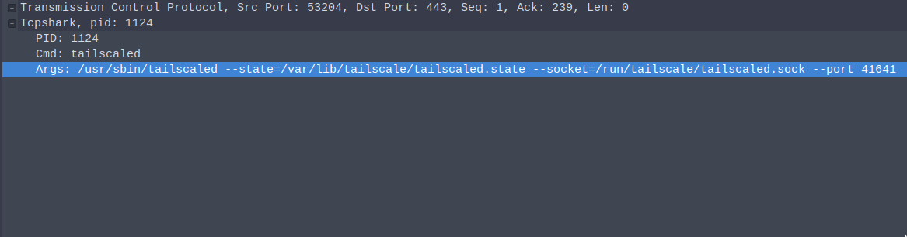

# TCPShark (WIP)

`tcpshark` is a tcpdump-like utility, with an extra feature: it stores the process id, the command and the arguments as a trailer for each Ethernet frame. For now, only TCP and UDP Ethernet packets are supported.

Tested on recent versions of Linux, Mac and Windows. 

`libpcap` or equivelant (`npcap` for Windows) is required. 




The trailer can be parsed via the lua script `tcpshark.lua`, which can be added to wireshark's plugin system, or directly injected in each run via `-X` option in `wireshark` (look below for examples). There's also an excellent video on loading custom dissectors for Wireshark here:

[](https://www.youtube.com/watch?v=xK2MPhUL2XY)

usage:

```sh
Usage:
  tcpshark [OPTIONS]

tcpshark:
  -o, --outfile=         Output pcap file path. Use '-' for stdout
  -i, --interface=       Interface to use. Only supports Ethernet type packets interfaces. Do not use it on SPANs (default: lo)
  -f, --bpf=             tcpdump-style BPF filter
  -v, --verbosity=       Verbosity of the metadata: 0 - only pid, 1 - pid and cmd, 2 - pid, cmd and args (default: 1)
  -l, --list-interfaces  List available interfaces and exit

Help Options:
  -h, --help             Show this help message

```

# Live capture in local system

```sh
git clone https://github.com/mosajjal/tcpshark
cd tcpshark
go get
go build .
sudo ./tcpshark -i eth0 -o - -v 2 | wireshark -X lua_script:tcpshark.lua -Y tcpshark -k -i -
```


# Live capture through SSH

```sh
scp tcpshark HOSTNAME:/tmp/tcpshark
ssh HOSTNAME sudo /tmp/tcpshark -i eth0 -o - -v 2 --bpf="'not port 22'" | wireshark -X lua_script:tcpshark.lua -Y tcpshark -k -i -
```

# Offline pcap

```sh
sudo ./tcpshark -i eth0 -o /tmp/test.pcapng
```
